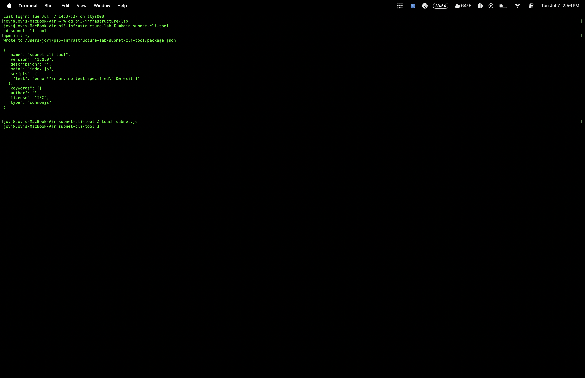
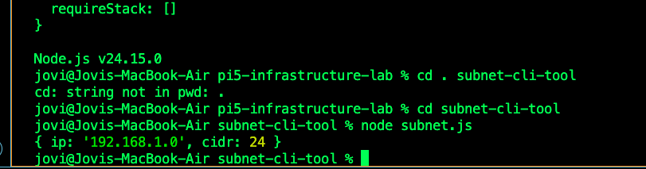
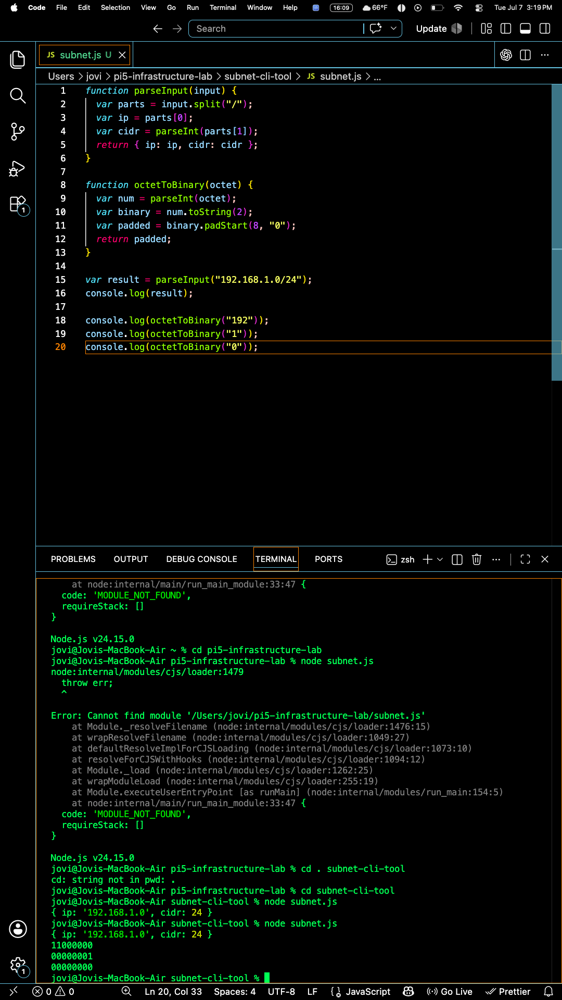
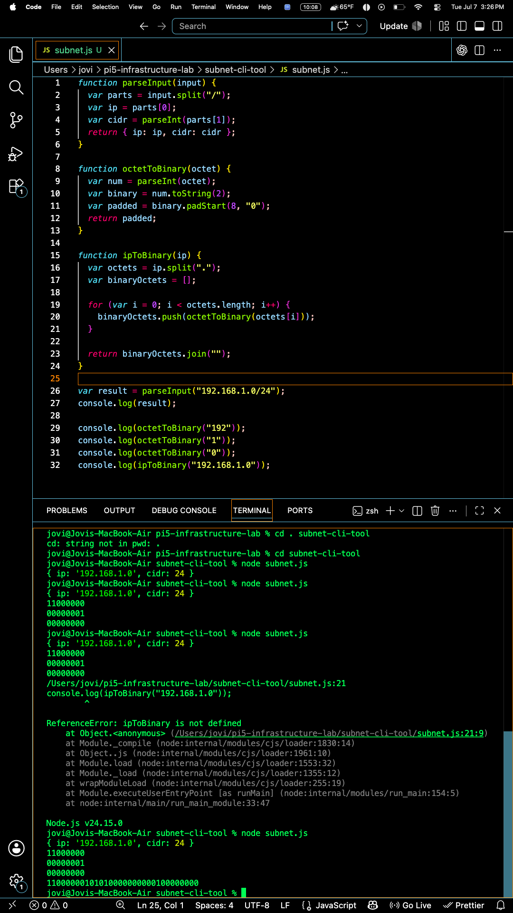
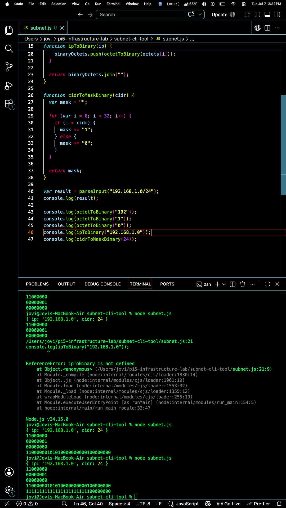
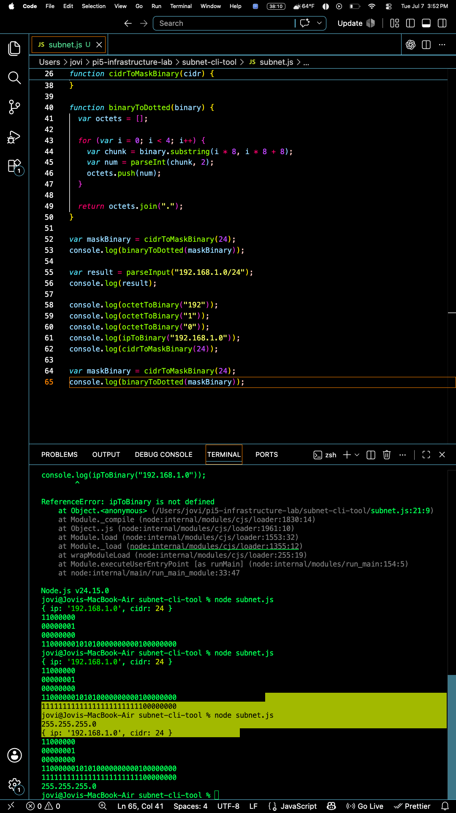
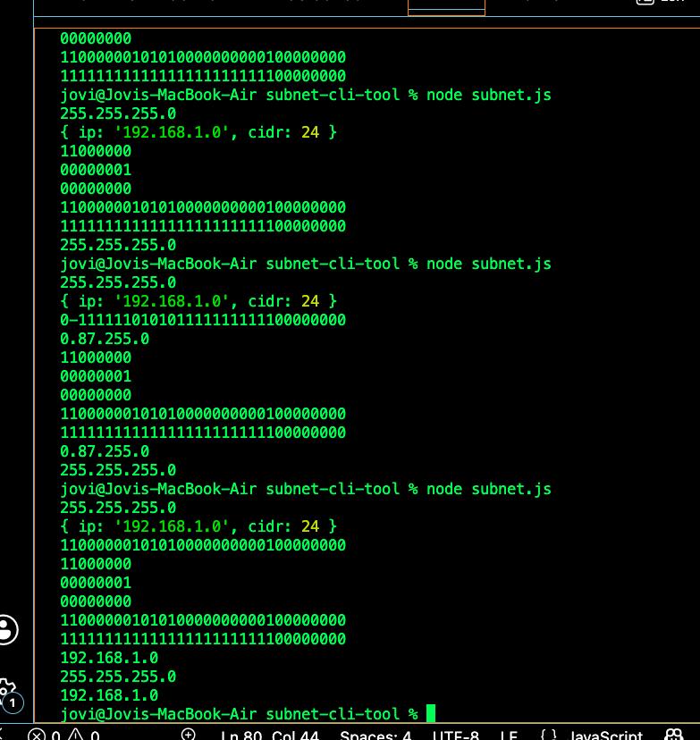
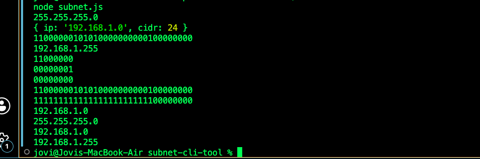
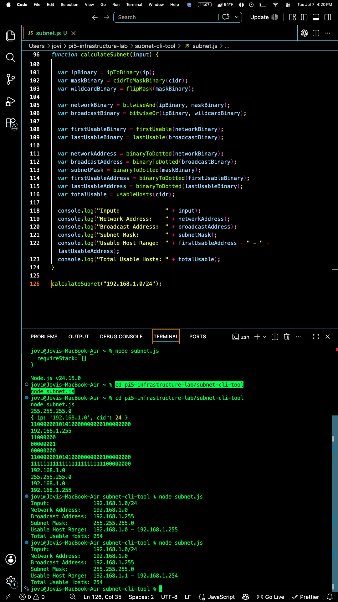
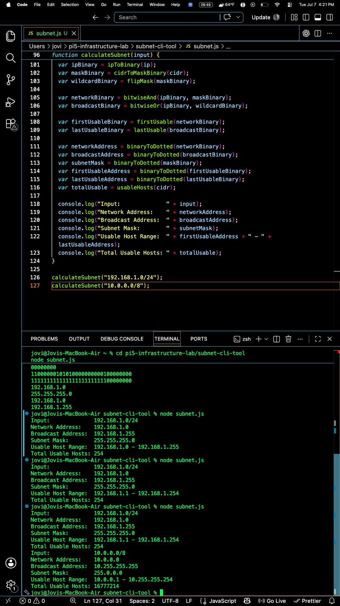

# Subnet CLI Tool (JavaScript)

A command-line tool built from scratch in Node.js that takes a network address in CIDR notation (e.g. `192.168.1.0/24`) and calculates everything about it — network address, broadcast address, subnet mask, usable host range, and total usable hosts.

Built as part of the JoviOS home lab project to prove networking knowledge and JavaScript fundamentals at the same time — no external libraries, no shortcuts. Every calculation is done manually using string parsing, binary conversion, and bitwise math.

> 📄 **Resume line:** *"Built a networking CLI tool in JavaScript for subnet calculation and IP range analysis"*

---

## What it does

Given an input like:

```
192.168.1.0/24
```

The tool outputs:

```
Input:              192.168.1.0/24
Network Address:    192.168.1.0
Broadcast Address:  192.168.1.255
Subnet Mask:        255.255.255.0
Usable Host Range:  192.168.1.1 - 192.168.1.254
Total Usable Hosts: 254
```

It works for any valid CIDR block, not just `/24`. Tested against `/8` (16,777,214 usable hosts) with no code changes required — proof the math is generalized, not hardcoded.

---

## Why I built it this way

Instead of using any built-in IP/networking libraries, I wrote every piece of the logic manually:

- Converting decimal IP octets to binary and back
- Building a subnet mask bit-by-bit from a CIDR number
- Using bitwise AND to calculate the network address
- Using bitwise OR (with a flipped/wildcard mask) to calculate the broadcast address
- Doing basic math for total usable host count

The goal was to actually understand *why* subnetting works at the bit level, not just call a library function that does it for me.

---

## How to run it

```bash
node subnet.js
```

Edit the last line of `subnet.js` to test different networks:

```js
calculateSubnet("192.168.1.0/24");
calculateSubnet("10.0.0.0/8");
```

---

## Build Process — Step by Step

### Step 1: Project setup
Initialized a fresh Node project and created the entry file.

```bash
mkdir subnet-cli-tool
cd subnet-cli-tool
npm init -y
touch subnet.js
```



### Step 2: Parsing the input
Wrote `parseInput()` to split a string like `"192.168.1.0/24"` into a usable IP string and a real (integer) CIDR number using `.split("/")` and `parseInt()`.



### Step 3: Converting individual octets to binary
Wrote `octetToBinary()` to convert a single decimal number (0-255) into an 8-bit padded binary string using `.toString(2)` and `.padStart(8, "0")`.



### Step 4: Converting the full IP to 32-bit binary
Wrote `ipToBinary()`, which loops through all 4 octets, converts each to binary, and joins them into one 32-character binary string.



### Step 5: Building the subnet mask from CIDR
Wrote `cidrToMaskBinary()`, which loops 32 times and builds a string of `1`s (network bits) followed by `0`s (host bits), based on the CIDR number.



### Step 6: Converting binary back to dotted decimal
Wrote `binaryToDotted()` to slice a 32-character binary string into four 8-bit chunks and convert each back into a normal decimal number, joined with dots.



### Step 7: Network Address (bitwise AND) — and a real bug
Wrote `bitwiseAnd()` to calculate the network address by ANDing the IP binary with the mask binary. Hit a real bug here — see `failures.md` for the full writeup on the signed-integer issue and the `>>> 0` fix.



### Step 8: Broadcast Address (bitwise OR + flipped mask)
Wrote `flipMask()` to invert the subnet mask into a wildcard mask, then `bitwiseOr()` to calculate the broadcast address.



### Final: Usable host range + full summary function
Wrote `usableHosts()` for the total host count, `firstUsable()` / `lastUsable()` to correct the usable range (network +1, broadcast -1), and `calculateSubnet()` to tie every function together into one clean, readable output.





---

## Functions Reference — What I Learned

Documenting every function as I learn it, for my own reference and to show the progression.

| Function | What it does | Key concept learned |
|---|---|---|
| `parseInput(input)` | Splits `"ip/cidr"` string into `{ ip, cidr }` object | `.split()`, `parseInt()`, returning objects vs arrays |
| `octetToBinary(octet)` | Converts one decimal number (0-255) to 8-bit binary string | `.toString(2)`, `.padStart()` |
| `ipToBinary(ip)` | Converts full IP string to 32-bit binary string | Looping through an array and building a string with `.push()` + `.join()` |
| `cidrToMaskBinary(cidr)` | Builds the binary subnet mask from the CIDR number | Loop + `if/else` to build a string bit by bit |
| `binaryToDotted(binary)` | Converts a 32-bit binary string back to normal dotted decimal | `.substring()` to slice a string into chunks |
| `bitwiseAnd(binary1, binary2)` | ANDs two binary strings — used for network address | Bitwise `&`, and the `>>> 0` fix for JS's signed 32-bit integer issue |
| `bitwiseOr(binary1, binary2)` | ORs two binary strings — used for broadcast address | Bitwise `\|` |
| `flipMask(mask)` | Inverts a binary mask (1s↔0s) to create a wildcard mask | Looping through a string character by character |
| `usableHosts(cidr)` | Calculates total usable host count | `Math.pow()`, basic host-bit math (2^hostBits - 2) |
| `firstUsable(networkBinary)` | Network address + 1, done in real binary math | Converting binary → number → math → back to binary |
| `lastUsable(broadcastBinary)` | Broadcast address - 1, same process in reverse | Same as above, reinforced |
| `calculateSubnet(input)` | The "boss function" — calls everything above in order and prints a clean summary | Function composition — building small pieces once, then wiring them together |

---

## Key Concepts Learned

- **Zero-based indexing** — arrays and binary positions start counting at 0, not 1. Position 2 is the *third* slot.
- **Bitwise AND (`&`)** — outputs `1` only if both bits are `1`. Used to zero out host bits → network address.
- **Bitwise OR (`\|`)** — outputs `1` if either bit is `1`. Used with a flipped mask to force host bits to `1` → broadcast address.
- **The `>>> 0` fix** — JavaScript treats numbers as signed 32-bit integers during bitwise math. Since IP octets like `192` start with a `1` bit, plain bitwise AND/OR can produce a negative number. `(result) >>> 0` forces the value back into unsigned territory. Full writeup in `failures.md`.
- **Network vs. Broadcast address** — network address = first address in the range (host bits = 0), broadcast = last address in the range (host bits = 1). Neither is usable by an actual device.
- **CIDR math** — the number of `1`s in a subnet mask always equals the CIDR number itself. Host bits = `32 - CIDR`. Total addresses = `2^hostBits`. Usable addresses = `2^hostBits - 2`.

---

## Tech Used

- Node.js
- Vanilla JavaScript (no external libraries)
